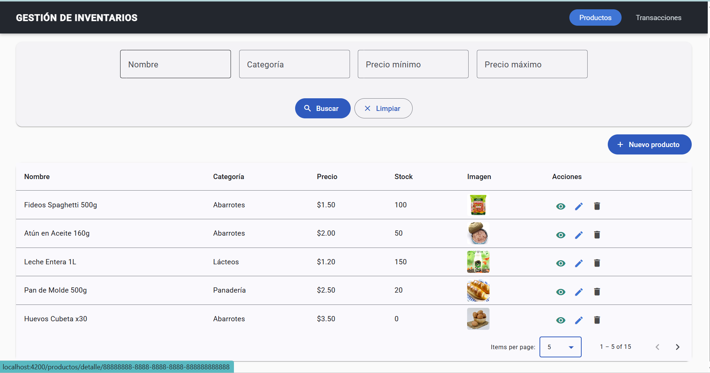
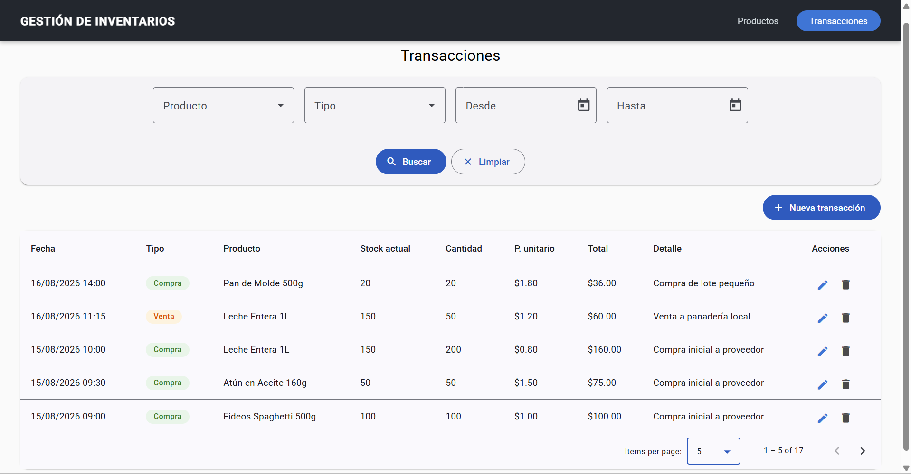
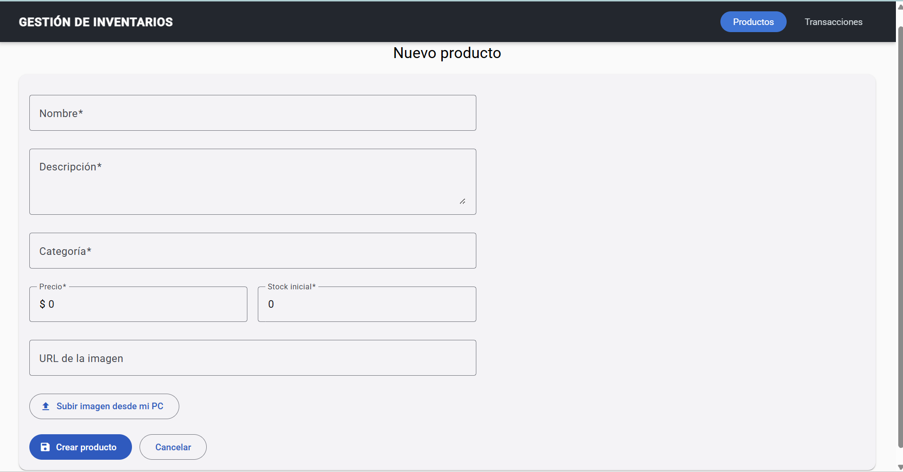
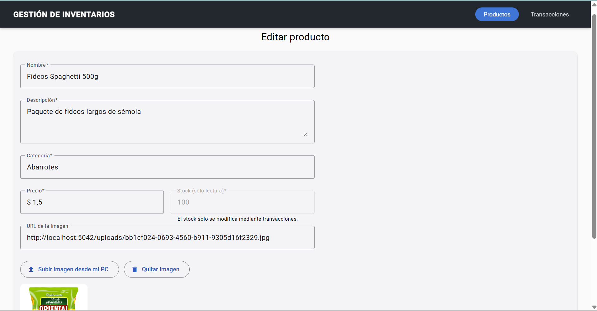
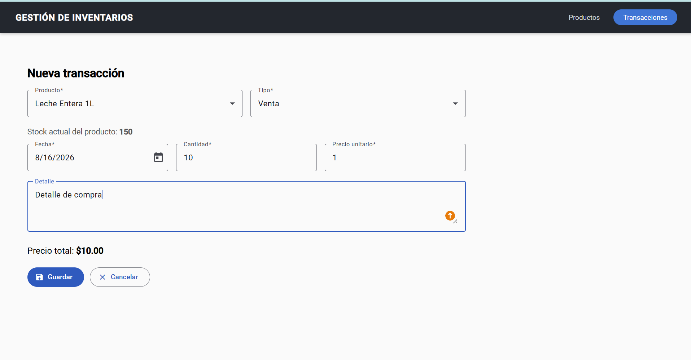
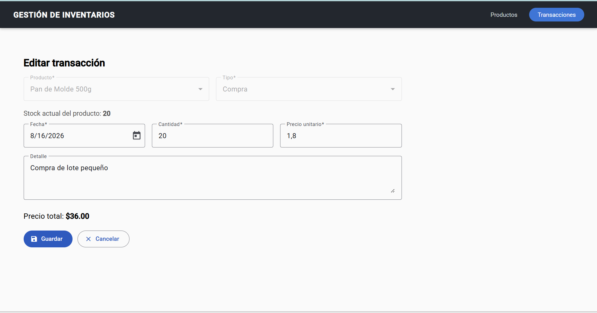
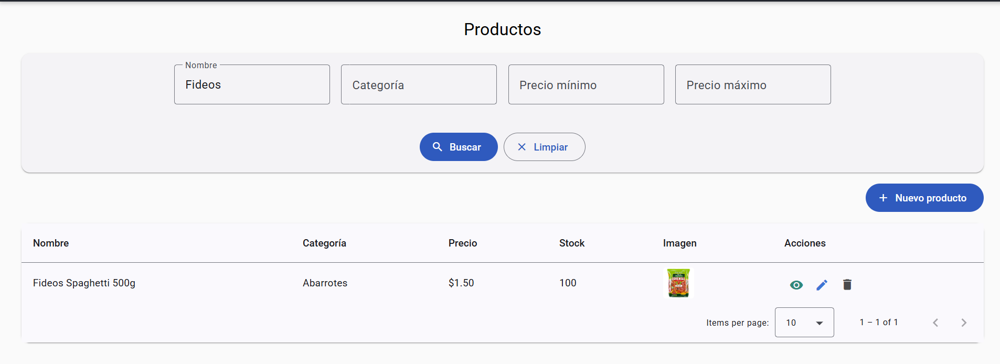
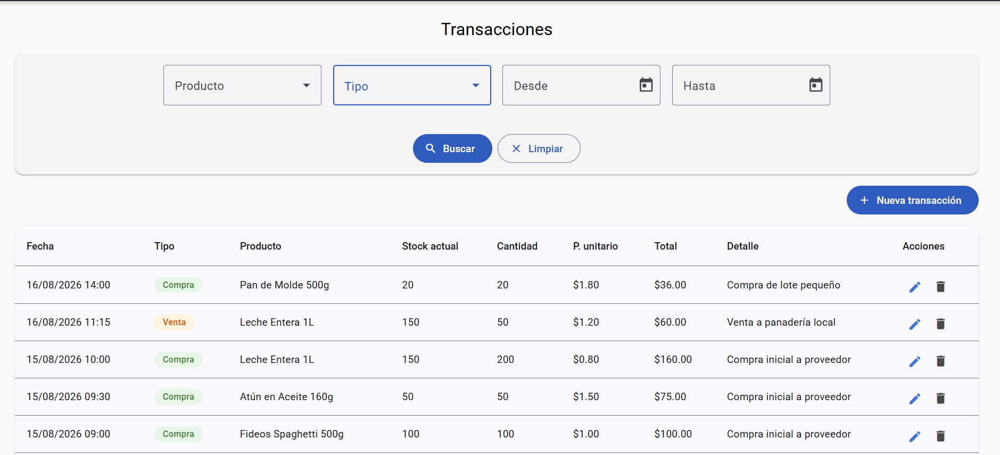

# Sistema de Gestión de Inventarios

Aplicación web para la gestión de productos y transacciones de inventario, construida con una arquitectura de microservicios en .NET y un frontend en Angular.

## Arquitectura

El backend está compuesto por dos microservicios independientes que se comunican de forma síncrona mediante APIs REST:

| Microservicio | Responsabilidad | Puerto |
|---|---|---|
| **ProductService** | Alta, edición, consulta y eliminación de productos. Es el único dueño del stock. | `5042` |
| **TransactionService** | Registro de compras y ventas. Solicita el ajuste de stock a ProductService. | `5104` |

Cada microservicio sigue **Clean Architecture** con cuatro capas (`Domain`, `Application`, `Infrastructure`, `Api`) y aplica **CQRS** con MediatR, patrón **Repository**, **Specification** para consultas dinámicas y **FluentValidation** para las reglas de entrada.

Ambos microservicios comparten una misma base de datos SQL Server pero con **esquemas separados** (`products` y `transactions`) y sin claves foráneas entre ellos, respetando el aislamiento de datos propio de los microservicios.

### Flujo de una transacción

Cuando se registra una venta, `TransactionService` llama por HTTP a `ProductService` para validar y descontar el stock. Si el stock es insuficiente, ProductService responde `409 Conflict` y la transacción no se crea. Si el stock se ajusta correctamente pero falla el guardado de la transacción, se ejecuta una **transacción compensatoria** que revierte el ajuste.

---

## Requisitos

Para ejecutar el proyecto en un entorno local se necesita:

| Herramienta | Versión mínima | Descarga |
|---|---|---|
| .NET SDK | 10.0 | https://dotnet.microsoft.com/download |
| SQL Server | 2019 o superior (sirve Express o LocalDB) | https://www.microsoft.com/sql-server/sql-server-downloads |
| SQL Server Management Studio | Opcional, para ejecutar el script | https://learn.microsoft.com/sql/ssms |
| Node.js | 20 LTS | https://nodejs.org |
| Angular CLI | 20 | `npm install -g @angular/cli` |

Verificación rápida:

```bash
dotnet --version
node --version
ng version
```

---

## Base de datos

1. Abrir **SQL Server Management Studio** y conectarse a la instancia local.
2. Abrir el archivo `database-script.sql` que está en la raíz del repositorio.
3. Ejecutarlo completo (`F5`).

El script crea la base de datos, los esquemas `products` y `transactions`, las tablas `Producto` y `Transaccion` con sus índices, e inserta un juego de datos de prueba (5 productos y 12 transacciones cuyo stock resultante es coherente).

> La sección de datos de prueba está claramente separada al final del script. Si se prefiere arrancar con las tablas vacías, basta con no ejecutar esa última parte.

### Configuración

Ambos microservicios leen su configuración desde `appsettings.json`.

**Cadena de conexión.** La base de datos se llama `InventoryDb` y por defecto se conecta a la instancia local de SQL Server con autenticación de Windows. Si la instancia no es la predeterminada, hay que ajustar `ConnectionStrings:DefaultConnection` en:

- `backend/ProductService/ProductService.Api/appsettings.json`
- `backend/TransactionService/TransactionService.Api/appsettings.json`

**Comunicación entre microservicios.** TransactionService necesita saber dónde está ProductService. Esa URL se configura en `backend/TransactionService/TransactionService.Api/appsettings.json`:

```json
"ProductServiceApi": {
  "BaseUrl": "http://localhost:5042"
}
```

Si se cambia el puerto de ProductService, hay que actualizar también este valor.

---

## Ejecución del backend

Los dos microservicios deben estar levantados al mismo tiempo, porque TransactionService depende de ProductService para el ajuste de stock.

### Opción A — Visual Studio

1. Abrir `backend/InventoryManagement.sln`.
2. Clic derecho sobre la solución → **Configurar proyectos de inicio**.
3. Seleccionar **Varios proyectos de inicio** y poner en **Iniciar** tanto `ProductService.Api` como `TransactionService.Api`.
4. Presionar `F5`.

### Opción B — Línea de comandos

Abrir dos terminales, una para cada microservicio:

```bash
# Terminal 1
cd backend/ProductService/ProductService.Api
dotnet run
```

```bash
# Terminal 2
cd backend/TransactionService/TransactionService.Api
dotnet run
```

Una vez levantados, la documentación Swagger queda disponible en:

- ProductService → http://localhost:5042/swagger
- TransactionService → http://localhost:5104/swagger

---

## Ejecución del frontend

```bash
cd frontend/inventory-app
npm install
ng serve
```

La aplicación queda disponible en **http://localhost:4200**.

Las URLs de los microservicios están configuradas en `src/environments/environment.ts`. Si se cambian los puertos del backend, hay que actualizarlas ahí.

> El backend ya tiene CORS habilitado para `http://localhost:4200`.

---

## Funcionalidades

### Productos
- Listado con tabla dinámica, paginación del lado del servidor y filtros por nombre, categoría y rango de precios.
- Creación y edición con validaciones de campos obligatorios, longitud y formato.
- Carga de imagen desde el equipo del usuario o mediante URL externa.
- Pantalla de consulta de detalle.
- Eliminación lógica (el producto se marca como inactivo, no se borra físicamente).

### Transacciones
- Listado con tabla dinámica, paginación y filtros por producto, tipo y rango de fechas.
- Cada fila muestra el nombre y el stock actual del producto asociado, obtenidos de ProductService.
- Registro de compras y ventas con cálculo automático del precio total.
- **Validación de stock**: no permite registrar una venta por encima del stock disponible, ni en el frontend ni en el backend.
- Al editar una transacción se recalcula el ajuste de stock por diferencia entre la cantidad anterior y la nueva.
- Al eliminar una transacción se revierte su efecto sobre el stock.

### Transversales
- Mensajes de éxito y error mediante notificaciones en pantalla.
- Manejo centralizado de errores en el backend con respuestas `ProblemDetails`.
- Interceptor HTTP en el frontend que traduce los errores del backend a mensajes legibles.

---

## Evidencias

### Listado dinámico de productos con paginación



### Listado dinámico de transacciones con paginación



### Pantalla para la creación de productos



### Pantalla para la edición de productos



### Pantalla para la creación de transacciones



### Pantalla para la edición de transacciones



### Pantalla de filtros dinámicos



### Pantalla de consulta de información de un formulario




---

## Estructura del repositorio

```
.
├── database-script.sql              Script de creación de base de datos y datos de prueba
├── README.md
├── backend/
│   ├── InventoryManagement.sln
│   ├── ProductService/
│   │   ├── ProductService.Domain/
│   │   ├── ProductService.Application/
│   │   ├── ProductService.Infrastructure/
│   │   └── ProductService.Api/
│   └── TransactionService/
│       ├── TransactionService.Domain/
│       ├── TransactionService.Application/
│       ├── TransactionService.Infrastructure/
│       └── TransactionService.Api/
├── frontend/
│   └── inventory-app/
└── docs/
    └── evidencias/
```
